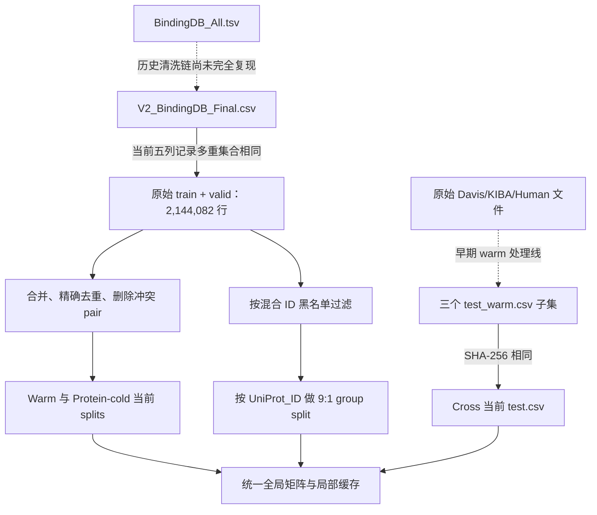

# V23 数据来源与脚本复核（第二轮）

日期：2026-09-05。核对对象为用户补充后的交接文件第 12 节，以及实际 CSV、矩阵、缓存、构建脚本。比较范围仍为 Warm、Protein-cold、Davis、KIBA、Human；原文件中的 ASBench 仅作为历史来源记录保留，不新增其比较。

本轮开始时交接文件 SHA-256 与用户提供值完全一致：

```text
cdca672c53a7687d92feedc69076f9bd1171ee89e710b83a8d5e0072a0fb628b
```

审计只读取既有数据并运行独立核验脚本；没有执行原始构建脚本中的覆盖保存、下载、训练或模型推理。新增结果都在本目录。原交接文件快照保存在 `files/`。

## 1. 结论与新增发现

| 核验项目 | 结果 | 对论文的影响 |
|---|---|---|
| 交接文件哈希与所列实际路径 | 一致 | 可以作为本轮来源入口 |
| CSV→矩阵标签 | 11 splits，共 5,466,235 行，逐行差异 0 | 当前标签与实际训练/评测矩阵对齐 |
| CSV→矩阵特征 | 固定审计 seed=20260905，抽查 2,837 行，最大绝对差 0 | 抽查支持行序正确；未声称全量 X 逐元素检查 |
| CSV→局部缓存行码 | 六个 source/validation splits 全量，atom/segment 行码差异均 0 | 局部分支与全局行序对齐 |
| Cross blacklist→过滤→GroupShuffleSplit | 1,308 ID 黑名单，过滤及最终 train/valid 均复现 | 当前 Cross 后半段构建链可复现 |
| Davis 黑名单的 ID 类型 | TDC 的 379 个 ID 与原始 source 的 UniProt_ID 匹配数为 **0** | “从 TDC 得到标准 UniProt 黑名单”注释错误 |
| Cross 外部测试来源 | 三个 test.csv 与早期 `*_test_warm.csv` SHA-256 完全一致 | 必须披露为处理后子集，不能写完整原始 Davis/KIBA/Human |
| V2 Final 与原始池关系 | Warm 原始 train+valid、Cross raw train+valid、V2 Final 的五列行多重集合相同，均 2,144,082 行 | 三条训练线可以追溯到同一当前原始池 |
| 早期原始 train/valid 分配 | 用现存 `06+08` 脚本逻辑不能复现 | 整条 BindingDB→最终 CSV 流程尚不能认证完全可复现 |

## 2. 实际数据流



图中的虚线表示还不能按历史输入和版本完整重建的步骤；不是已经证实每个候选脚本都实际执行过。

## 3. CSV、矩阵与缓存：已落实到实际内容

实际矩阵根目录：

`/mnt/home/dachuang/dtiam/DTIAM-main/DTIAM-main/external_benchmark/matrices/`

入口 `DTIAM-main/code/external_benchmark.py::build_matrices` 按 CSV 顺序读取 Ligand、Protein、label，以 catalog 查找实体对应 embedding，写入：

- X[:, :768]：BerMol pooled embedding。
- X[:, 768:]：ESM2 pooled embedding。
- y：CSV 中的二元标签，uint8。

本轮对 manifest 中除 ASBench 外的 11 个 split 全部检查：真实软链接目标、CSV SHA-256、矩阵 metadata 的来源 size/mtime、X/y shape/dtype、全量 y 行序。全部通过，当前 CSV 哈希也与上一轮审计一致。每 split 固定抽取首尾行及最多 256 个随机行，与 catalog 对应的 ligand/protein feature 行逐元素比较，全部为零差异。详见 [matrix_lineage.json](matrix_lineage.json)。

另外，所有训练和验证 CSV 都与 protein_sequences.npy / drug_smiles.parquet 的 lookup 重新映射，和缓存里的 source_row_codes / validation_row_codes 全量比较；六个 source/validation split 均没有错位。此处不是仅以“行数一样”判定对齐。

全局蛋白特征的实际来源是**有优先级的共享缓存表**，不是每个 split 各自单独算一次。`protein_embeddings.sources.json` 记录：优先从 in_domain_warm/protein.pt 补入 8,464 条序列，再从 Davis/Human 等缓存补缺，最后 cross source cache 补入 64 条。每个唯一序列一旦填充，不再被后续缓存覆盖。原始 sources.json 含 ASBench 的 143 条来源，属于生成全局 catalog 的历史记录。

局部缓存方面，Warm 和 Protein-cold 使用 Warm protein.pt，Cross 使用自己的 protein.pt。对三场景各自全部唯一蛋白，重建 segment 加权均值后与全局 pooled feature 比较，RMSE 中位数约 8.8e-6，最大 4.3864e-5，与 FP16 segment 量化下的近似重建相符。这里没有把非零误差宣称为泄漏或输入错位。见 [local_global_pool_comparison.json](local_global_pool_comparison.json)。

`build_v23_cross_caches.sh` 构建测试局部缓存时读取的是 Protein 列，不用测试标签；全局 catalog 覆盖测试实体用于冻结特征计算，与使用测试标签训练是不同事实。但不能把整个预计算过程描述为“从未读取测试输入”。

## 4. Cross source：脚本能复现，但 Davis ID 排除有缺陷

本轮使用本地已有 TDC 缓存：

`/mnt/home/dachuang/ColdStart_Process/scripts/data/davis.tab`

没有重新调用 TDC 下载。该缓存原始列为 ID1/X1/ID2/X2/Y；已从安装的 TDC `utils/load.py`、`multi_pred/bi_pred_dataset.py`、`multi_pred/dti.py` 核实 ID2 对应 API 返回的 Target_ID。

| 黑名单来源 | unique IDs | 在 raw source UniProt_ID 中精确匹配的 ID 数 |
|---|---:|---:|
| TDC Davis ID2 | 379 | **0** |
| KIBA test pdbid | 221 | 221 |
| Human test pdbid | 782 | 776 |
| 三者并集 | 1,308 | 不以来源数直接相加 |

Davis 的例子是 AAK1、ABL1p、ABL2、ACVR1、AMPK-alpha1；这些名称没有先映射为 source 使用的 accession，就直接参与 `Uniprot_ID.isin(blacklist)`。因此该 Davis 分支按直接 ID 比较不能剔除任何原始 source 靶点。部分 Davis 靶点仍可能被 KIBA/Human 的黑名单间接排除，不能推成“所有 Davis 靶点都保留了”。

证据：[id_namespace_audit.json](id_namespace_audit.json)；完整重建黑名单：[reconstructed_cross_target_blacklist.txt](reconstructed_cross_target_blacklist.txt)。

按照当前脚本逐步重建结果如下（内容比较为统一五列的有序 pandas 行哈希）：

| 阶段 | 重建行数 | 落盘行数 | 内容与行序 |
|---|---:|---:|---|
| train_raw → train_cold | 1,083,394 | 1,083,394 | 一致 |
| valid_raw → valid_cold | 62,699 | 62,699 | 一致 |
| 两者合并后 GroupShuffleSplit train | 1,044,070 | 1,044,070 | 一致 |
| 两者合并后 GroupShuffleSplit valid | 102,023 | 102,023 | 一致 |

GroupShuffleSplit 参数是 groups=Uniprot_ID、test_size=0.1、random_state=42。黑名单过滤的 source 总量 2,144,082 行，过滤后池 1,146,093 行。详见 [upstream_lineage.json](upstream_lineage.json)。

这说明“执行结果忠实于脚本”，同时也说明“脚本的标准 UniProt/Davis 隔离注释不成立”。两者可以同时成立。论文当前只能写按记录 ID 排除并给出实际序列 overlap，不宜写 strict sequence-cold 或 homolog-free。

## 5. 外部测试集合来自早期 warm 子集

以下每对文件的 SHA-256 完全相同，包括标签、行序和其他列：

| Domain | 当前 Cross test | 与其完全相同的早期文件 |
|---|---|---|
| Davis | ColdStart_Process/data/test_sets/davis_test.csv | PostMidterm_WarmStart_Process/data/processed/davis_test_warm.csv |
| KIBA | ColdStart_Process/data/test_sets/kiba_test.csv | PostMidterm_WarmStart_Process/data/processed/kiba_test_warm.csv |
| Human | ColdStart_Process/data/test_sets/human_test.csv | PostMidterm_WarmStart_Process/data/processed/human_test_warm.csv |

根路径均为 `/mnt/home/dachuang/`。

```text
Davis  36cda41f258f0b0d34c18cc4edc3f461b5f9a357d4dd5c26489f3aa114c69065
KIBA   75d4fa70e6c4ca146190fad73d420cc1d516c5bf97ba1259fd3f323691a3b4e8
Human  d14a515cc552e19b1f3257822a2521d8777623b56cc2f69687f675269727363d
```

`PostMidterm_WarmStart_Process/scripts/09_clean_three_datasets.py` 的输出路径就是上述 *_test_warm.csv。它按旧 train.csv 筛选：药物的 InChIKey 第一段在旧训练库内，并且测试蛋白与某条训练蛋白存在双向 substring 包含关系（`tp in rp or rp in tp`）。这既不是严格全文序列相等，也不是同源性比对。后面还存在覆盖清洗 CSV 的脚本，不能在没有历史日志时声称本轮已按完整历史条件重建这一步。

**已证实的强证据是三个文件逐字节相同；候选生成器及其条件已经定位，但本轮没有全量重跑 100 多万药物的 InChIKey 筛选。** 因此当前应称“早期 warm 处理线保留的外部测试子集，随后用于 Cross source 评测”。这不等于它们相对当前 Cross train 仍是 warm：Cross train 此后另行剔除了靶点 ID。

进一步与本地较早外部文件逐行核对（Ligand、Protein、label、pdbid，保留重复次数）：

| Domain | 较早文件行数 | 当前测试行数 | 当前行在较早文件中无法找到 |
|---|---:|---:|---:|
| Davis | 30,056 | 16,569 | 0 |
| KIBA | 118,083 | 46,970 | 0 |
| Human（有结构版本） | 6,593 | 2,397 | 0 |

仅按序列长度 ≤700/1000/1022/1500/2000 等过滤，均不能重建当前子集，因此不能把样本减少简单归因于截断或长蛋白过滤。

## 6. 标签与 Human 来源的进一步核验

Davis 生成器按 Kd≤100 nM 判 1。加入 pdbid 作为键后，16,569 行都能在原始 ligands/proteins/Y 矩阵中唯一确定相应二分类标签，未映射=0、标签歧义=0、标签差异=0；上一轮仅按 SMILES+sequence 造成的 Davis 歧义已在本轮消除。

KIBA 生成器跳过 NaN，并按 score≥12.1 判 1。当前 46,970 行全部可映射、标签均能在原始记录中得到支持；但即使加入 pdbid，仍有 55 行的相同键对应冲突标签（相同分子字符串可能来自不同原始 ligand ID）。因此要保留原始 row/ligand ID，不能提前合并相同输入对后假定其标签唯一。

Human：本地原始文本为

`/mnt/home/dachuang/DTI_Project/data/benchmark/human/data.txt`

共 6,728 行 SMILES/sequence/binary-label；当前 2,397 行全都可以按三列在原始文本多重集合中找到，差异 0。对应构建脚本 `DTI_Project/scripts/07_map_uniprot_download_structures_build_human_csv.py` 明确从 TransformerCPI Human 文本读入二元标签，做 UniProt/结构路径映射，不使用 affinity 阈值。文献引用、原始负样本构建方式、下载版本与许可证仍须补正式来源，不能由本地三列文本反推。

详见 [external_origin.json](external_origin.json)。

## 7. BindingDB 上游：已缩小缺口，但尚未完全重建

当前以下三者的五列行多重集合完全相同，均为 2,144,082 行、838,806 个正例：

1. `PostMidterm_WarmStart_Process/data/processed/V2_BindingDB_Final.csv`。
2. 同目录原始 train.csv + valid.csv。
3. `ColdStart_Process/data/train_sets/train_raw.csv + valid_raw.csv`。

这锁定了 Warm/Protein-cold 和 Cross 的共同当前原始池。Warm/Protein-cold 后续再按 in-domain 脚本合并、去冲突，得到 2,127,103 行；Cross 则在这个去冲突前的原始池上做 ID blacklist。因此两条线不是完全相同的数据清洗协议，不能把 in-domain 的“删除冲突 pair”规则自动套给 Cross。

上游早期 train/valid 保存为 2,017,343 / 126,739 行，不能只写 90%/10%。尝试用当前 V2 Final 执行 `06_split_train_valid.py` 的 9:1 stratification，再执行 `08_enforce_warm_start.py` 的冷实体移回 train 算法，重建为 2,018,634 / 125,448 行，与保存文件不一致，两侧各差 1,291 行。记录集合一致，但分配与顺序未复现，说明还缺历史输入状态、处理顺序或脚本版本；本次未把猜测作为解释。见 [original_warm_split_reconstruction.json](original_warm_split_reconstruction.json)。

初始 BindingDB 标签的候选脚本和日志也应区分：

- `PostMidterm/.../01_parse_and_clean_bindingdb.py`：选 Kd/IC50/Ki/EC50 的最小有效值，<100 nM 为正；优先 SwissProt，缺失时回退 TrEMBL；去除不等号后转浮点。
- `01_rebuild.log`：明确记录 100 nM 重建，输出 2,364,887 行；当前 V2 Final 是 2,144,082 行，之间还有筛选及覆盖步骤。
- `DTI_Project/scripts/01_clean_data.py`：按 Kd→Ki→IC50 第一个有效值，<100 nM，并有不同黑名单和去重键。
- 更早 `01_parse.log` 中存在 ≤10000 nM，但其日志输出路径是另一历史文件；不能据此断言当前 V23 用了 10000 nM 标签。
- processed 目录还有非法 SMILES 清洗、非标准蛋白字符替换为 X、长度>2000过滤、Y列改名等会覆盖多个 CSV 的脚本。这些改变文件而不保留逐阶段版本，不能省略成一次简单二值化。

本轮给本地 BindingDB_All.tsv 和当前 V2 Final 生成了 SHA-256，见 `data_input_hashes.json`，用于后续锁定本次审计的输入；新计算的哈希不补足过去缺失的执行日志，也不证明原始数据库发布日期。

## 8. 对交接文件与论文的具体修正

- 第 12.3 节标题采用“按靶点 ID 排除的 cross-domain source”，删除不加限定的 Strict；明确 Davis ID namespace 问题。
- 第 12.4 节加入三个 test 文件与早期 warm 子集完全一致的来源关系及对应生成器。
- 第 12.2 节加入共同 V2 原始池、in-domain 额外去冲突以及早期原始分配未复现的边界。
- 第 12.5 节区分共享全局蛋白 feature table 与分场景局部缓存来源。
- 仍保留第一轮实际完整序列交集：Protein-cold train/test 为 2 条、907 行；Cross train/Davis 为 14 条、945 行；Cross train/Human 为 6 条、8 行。该数字不因当前 ID 过滤链能复现而改变。

本轮没有修改被冻结的数据、黑名单生成脚本或既有指标。若后续目标是严格 sequence-cold，则需要另行构造并评测新协议；不能通过改写现有描述把旧结果认定为严格隔离。

## 9. 证据与复核边界

- `matrix_lineage.json`：11 splits 的路径、哈希、矩阵及缓存行序检查。
- `upstream_lineage.json`：原始池、Cross 过滤和 group split 重建。
- `id_namespace_audit.json`：Davis/KIBA/Human 黑名单 ID 类型与实际匹配。
- `external_origin.json`：三个外域与旧文件、原始 affinity、Human 文本的映射。
- `original_warm_split_reconstruction.json`：明确保存失败的早期分配重建结果。
- `source_snapshots.json` / `files/`：当前源码、元数据及原交接文件快照。
- `data_input_hashes.json`：大型输入和关键数据文件的 SHA-256，不重复复制 GB 级数据。

行记录的批量比较使用 pandas 64-bit 行哈希，具有理论碰撞边界；文件逐字节一致结论使用 SHA-256。X 只做已声明的固定抽样，y 和训练/验证局部行码为全量。本报告不涉及新增显著性检验或模型成绩调整。
